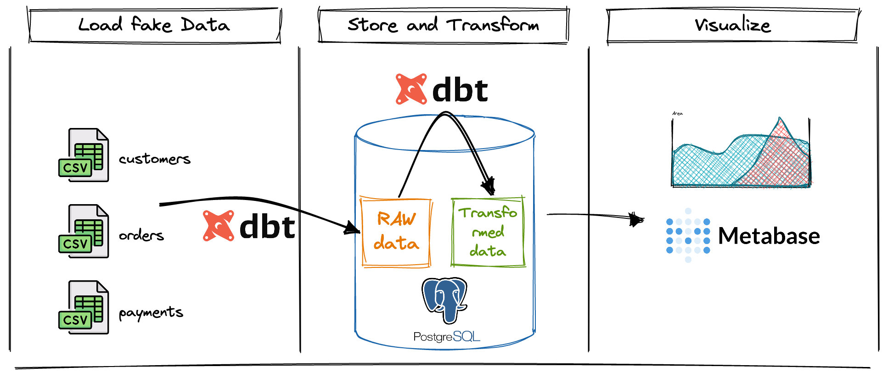

# DBT + PostgreSQL + Metabase workshop : a first analytics platform

Step by step workshop to build a first modern analytics platform with DBT, PostgreSQL and Metabase.
Only open source tools, and can be hosted locally on your computer for free or in the cloud!

## Goals and architecture

Initial goal is to have fun discovering some of most notorious modern data tools, with a typical use-case: analyze your orders and customers.

The BI platform pipeline that we will create is similar to this schema, whith dashboards as outputs: 

Output dashboard that we will generate from CSV files via Metabase:

## Data sample and exercises

Fake data is provided for this workshop, inside this `/fake_data/` directory.
Also, exercises and solutions are suggested.

## Follow this workshop! 

For convenience, a static website was generated! 

**Start the workshop here** : <https://dbt-postgresql-metabase-workshop.pages.dev/>

This website was generated with MKdocs.

Have fun!