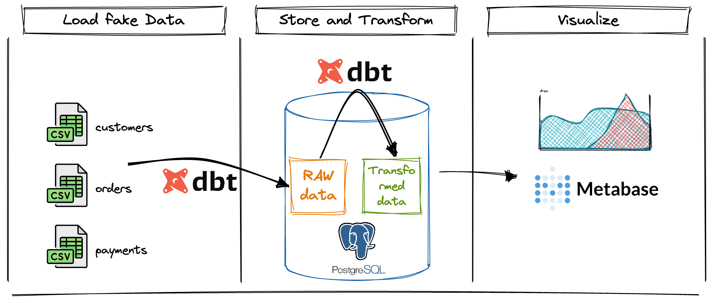

# dbt + PostgreSQL + Metabase = a first analytics platform

Step by step workshop to build a basic modern analytics platform with dbt, PostgreSQL and Metabase.
Only open source tools, and can be hosted locally on your computer or in the cloud!

I will assume this is the first time that you will use dbt and Metabase.

[Linked Github Repository, with fake data and exercise solutions](https://github.com/baaastijn/dbt-postgresql-metabase-workshop).

## Hello! :mouse: *What are we going to do tonight, Brain?* 

### Discovering awesome open source data tools

Initial goal is to have fun discovering some of most notorious modern data tools, with a typical use-case: analyze your orders and customers.

The BI platform pipeline that we will create is similar to this schema, whith dashboards as outputs: 

Over the years, dbt has trusted the charts as the "transformation workflow" tool, same for Metabase as open source business intelligence tool, along with Apache Superset. They work pretty well together, and are seen in many production architectures.

The last piece of data software that we will discover is PostgreSQL, who will act as a datawarehouse.
While Clickhouse, Google BigQuery or Snowflake might have been excellent choices for an analytical production platform, I selected PostgreSQL because it can be installed locally with zero expenses, and is a perfect fit for our light and standard needs.

### Building an analytics platform

Over this workshop, you will get a first introduction to dbt and Metabase features.

Our use case is quite simple: we are a company, with customers, orders and payments.
We want to build nice visualization dashboards, to monitor closely our activity.

More than dashboards, we want to avoid black magic, avoid technical debt, and for that we will use dbt to introduce best practive for analytics.

What this workshop is not : it's not an intensive worshop for experts, neither something to follow for best practices (it's more the opposite since we will skip few phases like Git synchonization, dbt, tests).

### What we are not building today

This is not a workshop to craft a modern data platform ready for production.
This is not an installation guide, best-practices neither an extensive documentation.

### Time and cost

**Expected time for this workshop** : it depends of your skills. If you are new to the cloud, let's say 4-5 hours.
If your have cloud/tech experience, +-2 hours.

**Cost** : **free** if you run everything locally. 

In the cloud, more or less 3 euros for 24h in OVHcloud:

 - AI Notebook (dbt host): 24h x 0,03 € = 0,72€
 - PostgreSQL managed database: 24h x 0,07€ = 1,68€
 - VM instance (metabase host): 24h x 0,0088€ = 0,021€

Ready? See you in few hours! Start by [setting up your environment](part1setup.md)