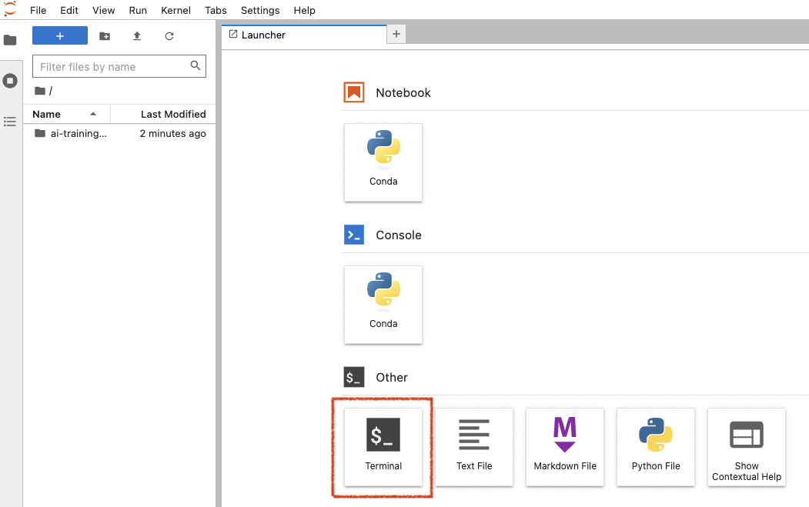

## Cloud or not cloud? Chose wisely!

This workshop will require to install few things such as DBT (Python package), a PostgreSQL client and Metabase (Docker image for the easiest installation way).

You can opt to install everything locally on your computer if you have enough access rights to do it.

You can also prefer to use cloud products such as virtual machines or Python Notebook.

The main advantage for this method is the ability to start with a clean development environment, and be able to delete safely everything at the end. Also, if you don't have admin on your own computer, it will be easier. Last but not least, you can share easily your cloud environment with someone for troubleshooting. Usefull during a workshop!

On the dark side, it can be seen as a bit complex if your are new with cloud. So, chose wisely!


## Requirements

Requirements may differ if you replay this workshop in the cloud or on your computer.

### If running on your computer :computer:

**Requirements**:

- A Python >= 3.8 environment with ability to install new packages such as DBT
- A PostgreSQL database (we will see how to install it)
- A PostgreSQL client to query a PostgreSQL database (like psql or PgAdmin)
- Ability to run Docker images (locally or in the cloud) or execute JAR file (for Metabase installation)
- basic technical skills such as building a SQL query, connect with SSH, ...

### If running in the cloud :white_sun_cloud:

You will need the same thing, but with... managed cloud products.

**For the next step, we will go for cloud products with OVHcloud**, a european cloud provider.
From an architecture perspective, it will look like this in the cloud:


**Requirements**:

- OVHcloud account created
- Python environment : OVHcloud AI Notebook (AWS doppeldanger : AWS Sagemaker notebook)
- Database: OVHcloud PostgreSQL (AWS: RDS for PostgreSQL)
- DBT: installed in a OVHcloud Jypter Notebook (AWS: Sagemaker Notebook)
- Metabase: installed in a OVHcloud virtual Machine (AWS: EC2 VM)
- PostgreSQL client: PgAdmin
- SSH client (Windows: Putty or similar)
- SSH key configured (to access virtual machines remotely)


## Step 1: (optional) prepare a cloud Python environment

> :man_mage: As explained previously, we will use OVHcloud products in this workshop. It's optional, **you can skip this step if you prefer to use your own Python environment (your computer for example)**.

This workshop needs a Python environment, with the ability to browse files easily.
To be more visual and practical, we will opt for a Python notebook code editor. Most used ones in the world are JupyterLab and VSCode. We will create one in the cloud now.

If required, create an OVHcloud free account or log in: 

1. Log in OVHcloud control panel: <https://www.ovhcloud.com>.
2. Go to Public Cloud section in the top menu.
3. Create a new project if required.


Once your project is created, create a new AI Notebook with these parameters:

- **name**: dbt-notebook  
- **code editor**: Jupyter lab
- **Framework**: Miniconda with python >=3.8
- **Privacy**: public access (anyone will have access to it. useful for a workshop, NOT recommended for production or sensitive information)
- **Datacenter**: as you wish
- **Resource**: CPU x1
- **Attach a git repo or data container**: no
- **SSH key**: no

Once your notebook is running (it should take less than 1 minute), you can access it by clicking on `JupyterLab` button:


This notebook is a Linux environment running inside a Docker image. It gives you the ability to live code directly in your web browser. You can install additional package swith classic Python commands such as `pip install`and `conda install`. 
Also, you can share your environment with someone else just by sharing your notebook URL. Very useful during a workshop session when you need some help :wink:.

Now, click on the `Terminal` icon inside this notebook.



## Step 2: check your Python environment

This tutorial requires Python >= 3.8.
To check your current Python environment, type in a terminal:

```python
$ python --version
Python 3.9.5
```

Mine is on version 3.9.5. If you have a deprecated version, please upgrade it at least to >=3.8.

> :bulb: A best practice is to create a new python environment with Conda. In this workshop, we will not since we are creating a new linux environment that we will trash just after. But feel free to do it, especially with local installation. If your a new with that, look for *Conda environments* in your preferred search engine.

## Step 3: set up a PostgreSQL server

For this workshop, we will use a PostreSQL server to store and transform our data.

PostgreSQL is an open source and community-based transactional database management system, widely used accross the world. Perfect for a workshop but also for production. It has not the flexibily of modern lakehouse such as Snowflake or BigQuery (compute and storage are linked for example, and information is stored in row format, not columnar) but can be relevant in many Business Intelligence use-cases where performance is not the main criteria.

To setup a new database server, two solutions:

- Use a managed Cloud Product such as OVHcloud for PostreSQL (paid).
- install yourself a PostgreSQL somewhere (eg. your computer, free).

### Option 1: launch an OVHcloud managed PostgreSQL

We will go for a OVHcloud product here:

1. Go to [OVHcloud control panel](https://www.ovhcloud.com/auth/).
2. Go to Public Cloud section in the top menu.
3. Create a new project or select an existing one.

Once your project is ready, select `Databases`in the left menu then create a new one with these parameters:

- **Database type**: PostgreSQL 14
- **Plan**: Essential (1 node)
- **Region**: as you wish
- **Size of nodes**: smallest one, like DB1-4
- **Options / Network**: Public network (open to internet access)

Launch this managed database server.
Once this server is up and running, you will have to configure users and authorized IPs.

Go in `Users` tab, and regenerate a password for user `**avdadmin**`. Copy his password safely.
You can also opt for a new user creation via a PostgreSQL client if you are more comfortable. Be sure to grant him admin role.

Now go in `Authorized IPs` and add the IP **0.0.0.0/0**.
It's a wildcard allowing any IP in the world. 

> :warning: an IP Wildcard is useful for a workshop or troubleshooting, but not recommended at all for production. Anyone will be able to contact your cluster.

### Option 2: manual installation (self-hosted)

If you opt for a manual installation, follow official instructions here: <https://www.postgresql.org/download/>.
This workshop was tested with PostgreSQL 14.

Once installed, configure a new database. 
You can find alternative websites with detailled tutorials like <https://www.postgresqltutorial.com/postgresql-getting-started/> to guide you through the steps.

> :bulb: installing a database server, transformation tools and dataviz tool in the same local environment is really dangerous. These stunts are performed by trained professionals, don't try this in production..

## Setup done!

The full workshop environment is now up and running! Now move to the [Part 2: install DBT](part2dbt.md)