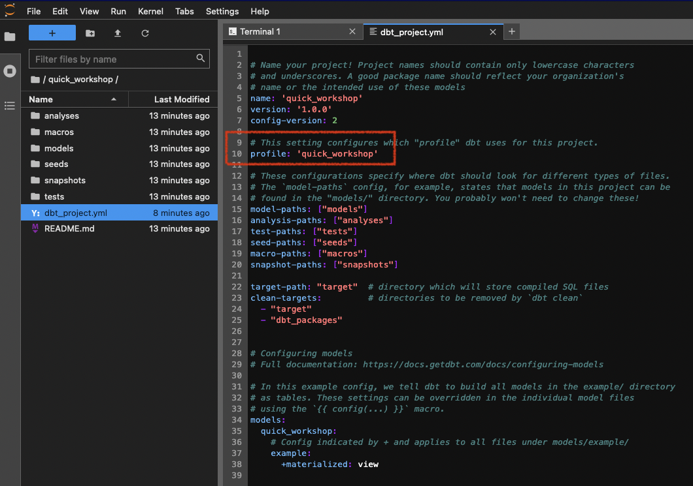
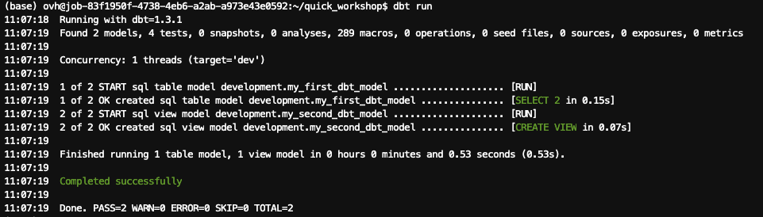

Great! On the previous part, we setup a Python environment and a datawarehouse via PostgreSQL.
It's now time to install the first data software, dbt!

## :octopus: What the hell is dbt?

Good question! I still don't know *exactly* after few hours. dbt is the acronym of Data Build Tool and was created in 2016 by some folks of RJMetrics.

Here is quote from their official website: *dbt is a transformation workflow that helps you get more work done while producing higher quality results. You can use dbt to modularize and centralize your analytics code, while also providing your data team with guardrails typically found in software engineering workflows. Collaborate on data models, version them, and test and document your queries before safely deploying them to production, with monitoring and visibility*.

dbt is an answer to all team facing analytics issues. *Who made a change on this query?. Where can I find explanation about this data? How can i rollback to the queries made 1 week ago? How can I test safely before running is in production?*. You see what I mean. Artisanal mode.

If I try to sum-up, with data analytics your start with multiple data sources and end up with results, like reports or dashboards. Between sources and results, the workflows you put has to be structured, tested, documented, collaborative, and shared safely.

We already do that widely for software. A devops culture. If you develop a software, you will push you code on Git, collaborate with branches, do some versioning, document you code directly, build CI/CD pipelines, ... 

Why not doing the same with data analytics ? Software engineering is here since long, now let's embrace analytics engineering! 

dbt is one of the answer :) Don't hesitate to read more with the [dbt viewpoint](https://docs.getdbt.com/community/resources/viewpoint).


## Install dbt

> :bulb: Check official documentation for complete guidance: <https://docs.getdbt.com/docs/get-started/installation>.

dbt comes in two versions:

- dbt Core, that you can install yourself as self-hosted. It's free and open source.
- dbt Cloud, where you will get a managed version of dbt, with more features. It's a paid plan.

We will install **dbt Core** in our case.

Since we will use dbt with PostgreSQL, we will install dbt Core and dbt PostgreSQL connector at once.

Go in your Python terminal and type:

``` bash
# Update PIP to the latest version
$ python -m pip install --upgrade pip
(...)

# Install dbt Core and dbt PostgreSQL connector at once
$ pip install dbt-postgres
(...)

# Verify versions
$ dbt --version
Core:
  - installed: 1.3.1
  - latest:    1.3.1 - Up to date!

Plugins:
  - postgres: 1.3.1 - Up to date!
```

### Create your first project

dbt works with projects, containing your configuration, SQL models, and much more.

Create your first one with `dbt init`:

``` bash
$ dbt init quick_workshop
09:47:12  Running with dbt=1.3.1
09:47:12  Creating dbt configuration folder at /workspace/.dbt
Which database would you like to use?
[1] postgres
(...)
Your new dbt project "quick_workshop" was created!
```

2 new folders appeared in your directory, `Logs`and `quick_workshop`.

Move to this project folder with your terminal:

``` bash
# Go to new project folder
$ cd quick_workshop

# list content files
$ ls
README.md  analyses  dbt_project.yml  macros  models  seeds  snapshots  tests
```

Congrats, your first project is created!

Quick description about these directories:

| Directory | Description |
| --- | --- |
| analyses | where you can compile SQL queries, more often for later usage as analytical queries  |
| macros | blocks of code that you can reuse multiple times |
| models | where you put your code. 1 file = 1 model. Usually your code transforms raw data in intermediate or final datasets |
| seeds | Static CSV data that you can load via dbt |
| snapshots | when you capture the state of your data tables, to refer to it later |
| tests | SQL/Python tests you can run to validate your data or models. |


When you initialize a dbt project, there is also the file `dbt-project.yml`, which contains useful parameters.
A name, a version, models to build but also a **profile** to use.

As explained before, **dbt does not process data itself**. There is no compute, no "power". dbt is linked to something doing transformation tasks. Most famous ones are PostreSQL, BigQuery, Snowflake, Spark, ... 
Here in profile, you can redirect this project to a profile to use.

Keep it like the screenshot ie. `quick_workshop`.



### Connect dbt to your PostgreSQL server

dbt connects to your datawarehouse using a profile, which is a `.yml` file created during our first project init. You were notified about his creation during the `dbt init`in the previous step, and his directory path was also shown.

Let's edit this file:

1. Open your Python terminal.
2. Open your `profile.yml` file, in our case it's in `/workspace/.dbt/profiles.yml`.

``` bash
# Open profile.yml with your preferred code editor such as Vim/nano/...
$ nano /workspace/.dbt/profiles.yml
```

By default, your profile should look like this:

``` yml
quick_workshop:
  outputs:

    dev:
      type: postgres
      threads: [1 or more]
      host: [host]
      port: [port]
      user: [dev_username]
      pass: [dev_password]
      dbname: [dbname]
      schema: [dev_schema]

    prod:
      type: postgres
      threads: [1 or more]
      host: [host]
      port: [port]
      user: [prod_username]
      pass: [prod_password]
      dbname: [dbname]
      schema: [prod_schema]

  target: dev
```

Replace values with your PostgreSQL server informations.

In our case, with an OVHcloud PostgreSQL service:

``` yml
quick_workshop:
  outputs:

    dev:
      type: postgres
      threads: 4
      host: postgresql-5c66e728-o90e8df85.database.cloud.ovh.net
      port: 20184
      user: avnadmin
      pass: hmTiDdN0y*********
      dbname: defaultdb
      schema: development
      sslmode: require

    prod:
      type: postgres
      threads: 4
      host: postgresql-5c66e728-o90e8df85.database.cloud.ovh.net
      port: 20184
      user: avnadmin
      pass: hmTiDdN0y*********                                
      dbname: defaultdb
      schema: production
      sslmode: require

  target: dev
```

Notice a few things :

- You can get a development and a production environment, or even more.  Here, in the target, **we ONLY interact with dev**.
- You can differenciate the schemas used if you want to. We did it there, with the same database server BUT two schemas.
- SSL mode is required for OVHcloud databases services, but not if you are running PostgreSQL locally.
- 1 thread means no tasks parralelization. Default is 4. it mean dbt will run 4 jobs in parallel. If you put it to 1, it will wait to end the first tasks to start a new one.

> A best practice is to fully separate development and production environment. First to avoid human mistakes such as data deletion, but also to isolate compute resources. Having an splitted dev platform will allow you to run intensive queries without being scared to "disturb" production performances. 

Save this configuration and close this `profile.yml` file.

### Test your environment

First, run a debug:

``` bash
quick_workshop$ dbt debug
```


If all checks have passed, we are good! dbt is able to find your configuration and able to connect to PostgreSQL.

### Perform a first dummy dbt run

During the project initialization, dbt pushed examples inside the `models` folder.

When your perform a dbt run, dbt looks for models inside this folder and will run them.

> If you go back to the previous step, you will notice at the end of your `dbt_project.yml` configuration that we asked to build models inside /models/examples.

Perform your first run:

``` bash
quick_workshop$ dbt run
(...)
```



As shown in the result, 2 models were completed successfully.

These models are dummy ones. You can check what's inside by browsing into `/models/examples` and open the `.SQL` files. 
In short, the first SQL model will perform a SELECT on a fake source data, and the second dbt model will perform a SELECT on top of the first SQL model. 

The good thing is, dbt is able to materialize results. so you can reuse your results easily (like, hmmm, for BI reports maybe ?:wink:). It was the case for these two models. 

The most used materializations are `views`and second ones are `tables`.
A `view` can be seen as a virtual table: every time you ask for it, the model is rebuilt. It **does not store data** in your datawarehouse but will virtually aggregate information to create something to *view*.
A `table` will create a real table in your datawarehouse. dbt writes the result on disk. 

> :bulb: More information and more materialization options are available with dbt <https://docs.getdbt.com/docs/build/materializations>.


Both have pros and cons, and the power of dbt is that you can specify this materialization directly in your models. 

As an example, if I select `table` here is what i can see inside my PostgreSQL cluster now:


## :thumbsup: dbt is correctly initialized!

Now that we runned our first dbt run, let's bring datasets and build our own models! 

Go to the [next part, data ingestion](part3ingest.md).
