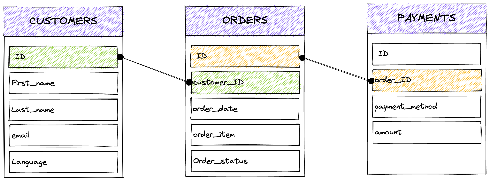

Your DBT project is now ready to be used. Time to play with data!


## About DBT and seeds

DBT allows CSV data ingestion, called `seeds` (remember the *seeds* folder?).

Best practive is to use `seeds` when you need to control static and versionned data.

Imagine that you are running everytime the same analysis for your business, but you want to exclude a list of 20 internal accounts. How ? Well, by using seeds.

Seeds workflow is:

1. add CSV files into your *quick-workshop/seeds/* folder.
2. run the `dbt seed` command
3. CSV files are loaded as tables inside your datawarehouse.
4. if you modify your CSV by adding lines, the tables will be updated during the need `dbt seed`.

> :bulb: More information and more options: <https://docs.getdbt.com/docs/build/seeds>. For example you can modify the `seeds`default directory, or specify a column datatype instead of betting on autoselection.

### Download fake data

> :man_mage: For easiness, this fake data is inspired from official dbt example called `jaffle_shop`but with extra columns for better use-cases with Metabase (more fields, and more lines). Full credits goes to this official DBT example repository.

**Download** the fake data provided in this workshop Github repository.
It consist of 3 CSV files, wike fake data (generated with www.Mockaroo.com).

**Copy** these CSV files inside the `quick_workshop/seeds` folder.

You can do if with click-cloick-click in your Jupyter Notebook, or just get them via your Python terminal:

``` bash
# Move to the Seeds folder
quick_worksop$cd seeds

# Download 3 CSV file from this Github repository
seeds$wget https://raw.githubusercontent.com/baaastijn/dbt-postgresql-metabase-workshop/main/fake_data/raw_orders.csv
seeds$wget https://raw.githubusercontent.com/baaastijn/dbt-postgresql-metabase-workshop/main/fake_data/raw_customers.csv
seeds$wget https://raw.githubusercontent.com/baaastijn/dbt-postgresql-metabase-workshop/main/fake_data/raw_payments.csv

# Go back to your main DBT directory
seeds$ cd ..
```

### Ingest fake data

For this workshop, we will tweak the use of `seed` to import fake data.

> :bulb: Usually you don't need to bring fake data like this, because you already have something in yur database. But hey it's a workshop :smirk:. If you want to extend this workshop, I recommend to ingest data with open source tools such as **Airbyte** or **Meltano**. Both can also be self-hosted or provided as SaaS offers.


From a entity relationship diagram (ERD) point of view, data is linked like this:




Now that your data is downloaded inside your `quick_workshop/seeds` directory, run a `DBT seed`:

``` py
quick_workshop$dbt seed --full-refresh
14:38:29  Running with dbt=1.3.1
14:38:29  Found 2 models, 4 tests, 0 snapshots, 0 analyses, 289 macros, 0 operations, 3 seed files, 0 sources, 0 exposures, 0 metrics
14:38:29  
14:38:30  Concurrency: 4 threads (target='dev')
14:38:30  
14:38:30  1 of 3 START seed file development.raw_customers ............................... [RUN]
14:38:30  1 of 3 OK loaded seed file development.raw_customers ........................... [INSERT 100 in 0.31s]
14:38:30  2 of 3 START seed file development.raw_orders .................................. [RUN]
14:38:32  2 of 3 OK loaded seed file development.raw_orders .............................. [INSERT 1000 in 1.72s]
14:38:32  3 of 3 START seed file development.raw_payments ................................ [RUN]
14:38:33  3 of 3 OK loaded seed file development.raw_payments ............................ [INSERT 1000 in 1.36s]
14:38:33  
14:38:33  Finished running 3 seeds in 0 hours 0 minutes and 3.66 seconds (3.66s).
14:38:33  
14:38:33  Completed successfully
14:38:33  
14:38:33  Done. PASS=3 WARN=0 ERROR=0 SKIP=0 TOTAL=3
```

Data is now imported! Pushed as 3 x tables into your datawarehouse.

when taking a look with a PostgreSQL client like PgAdmin, you can see three new tables :


## Data is now loaded!

Data is loaded, it's now time to generate analytics-ready views and tables! Go to the [next part, with transformations](part4transform.md).