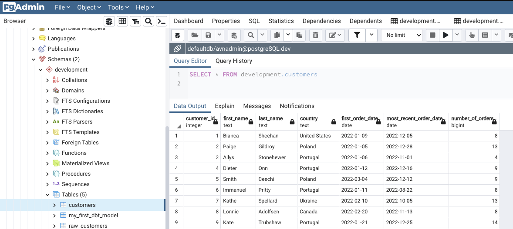

The current data is exhaustive but splitted in multiple tables.

You have the users, the orders, the payments:


How can you get more actionable views? For example:

- For each customer, a total amount of orders.
- The last order from each customer.
- Revenues per country.
- ...

Without dbt, you can get those answers with classic SQL syntax, directly by querying PostgreSQL 
It will work fine. But wait.

Imagine that you don't have one query but one of a dozen, nested together like pipelines (first *anonymize data*, then *remove fraud*, then *calculate revenues*, ...) not run punctually but with recurrence, with vast amount of data, a critical production. Also imagine that you want to share your queries globally and with control, with versionning, tests, generated documentation and co? 

That's when dbt is relevant, bringing your transformation workflows and control over SQL queries or Python code.

## Create your first SQL model

Browse your `quick_workshop/models/` directory.

Delete the `example` folder, not required anymore.

Create a new file named `customers.sql`. Open this file and copy the code below:

``` sql
with customers as (

    select
        id as customer_id,
        first_name,
        last_name,
        email,
        country

    from {{ ref('raw_customers') }}

),

orders as (

    select
        id as order_id,
        customer_id,
        order_date,
        order_item,
        order_status

    from {{ ref('raw_orders') }}

),

customer_orders as (

    select
        customer_id,

        min(order_date) as first_order_date,
        max(order_date) as most_recent_order_date,
        count(order_id) as number_of_orders

    from orders

    group by 1

),

final as (

    select
        customers.customer_id,
        customers.first_name,
        customers.last_name,
        customers.country,
        customer_orders.first_order_date,
        customer_orders.most_recent_order_date,
        coalesce(customer_orders.number_of_orders, 0) as number_of_orders

    from customers

    left join customer_orders using (customer_id)

)

select * from final
```

**Save** this file.

Few explanations about this code sample:

- We start by selecting few columns for the Table `raw_customers`.
- We do the same from the table `raw_orders`.
- We then create new columns, respectively the first order date, the most recent, and the total or orders.
- we build a final query regrouping columns from multiple parts.
- finally we select everything (*) from this query.
- SQL info: the coalesce() function give you the first `NOT NULL` result. Here if `number_of_orders`is null, it will replace it by zero to avoid empty cells.

## Reconfigure your project 

During dbt project initialization, dbt was configured to run models only from `/example` directory.

Current configuration inside `dbt_project.yml` is:

```
models:
    quick_workshop:
        example
            +materialized: table
```

Since we deleted the `quick_workshop/models/example` directory, we have to modify this part.

Modify the file `dbt_project.yml`and put this new configuration instead:

```
models:
    quick_workshop:
        materialized: table
```

It will now take into account our SQL files pushed at the *root* of `quick_workshop/models`.

## Run dbt

Now let's run dbt. It will browse the *quick_workshop/models* directory:

```python
quick_workshop$ dbt run
10:24:53  Running with dbt=1.3.1
10:24:53  Found 1 model, 0 tests, 0 snapshots, 0 analyses, 289 macros, 0 operations, 3 seed files, 0 sources, 0 exposures, 0 metrics
10:24:53  
10:24:53  Concurrency: 4 threads (target='dev')
10:24:53  
10:24:54  1 of 2 START sql table model development.customers ............................. [RUN]
10:24:54  1 of 2 OK created sql table model development.customers ........................ [SELECT 100 in 0.11s]
10:24:54  
10:24:54  Finished running 1 table model in 0 hours 0 minutes and 0.56 seconds (0.11s).
10:24:54  
10:24:54  Completed successfully
10:24:54  
10:24:54  Done. PASS=1 WARN=0 ERROR=0 SKIP=0 TOTAL=1
```
 
 Model was run successfully and table also created.

## Check the result in your datawarehouse

What we are waiting for, is a new table created in our datawarehouse, containing our aggregated data.

Good news this is exactly what we have :wink:.




## Exercise 1: build another dbt model :wink:

Now that we discovered a bit more how dbt works, let's try to build another model yourself.

Our Marketing team would love to target more accurately some geographical areas, and want to create a country dashboard. 

You have to create a new **table** in our datawarehouse, analyzing revenues per country.
Also, we only want to summarize revenues for orders where status is **true** (meaning it's paid).

The table columns should be like this:

| Country | Total of orders | Total revenue |
|---------|-----------------|---------------|
| France  | 37              | 2530          |
| ...     | ...             | ...           |

Create this new table and save it inside *quick_workshop/models/countries.sql*.

> :bulb: Hint: required data is splitted into three tables (customers, orders, payment). Time to learn about SQL JOIN :wink:.

If you are blocked, you can find the solution in this Github repository, in the *exercises* folder.

## Exercise 2: remove suspicious accounts

Our Data team is convinced that we need to remove all emails ending with **@facebook.com**, because 100% of the time it's fraudulent accounts.

The goal here is to skip some irrelevant data that are ingested regularly.
They also told us that they are investigating, but other emails system will have to be banned in the future.

How do you proceed ?

Same, if you are blocked, a solution can be found in this Github repository (top right corner for the link)!

## :rocket: Transformers GO!

You just successful transformed raw data to actionable data, stored in a datawarehouse.
All of that without black magic!

But can we do better? Sure we can. Why not [generate and host a static documentation with two lines of code](part5documentation.md)?
