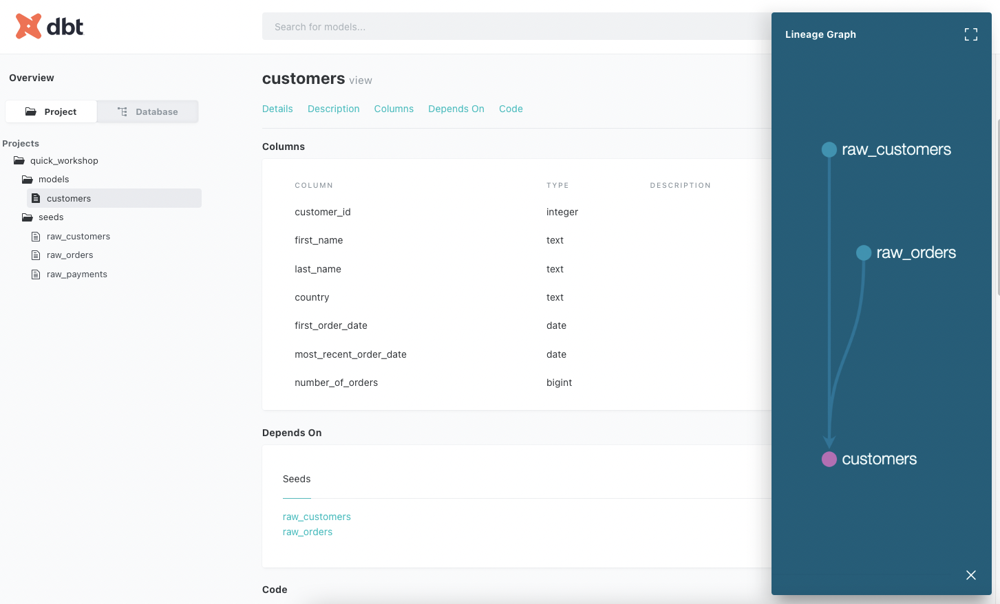

Let's get back to the topic of building a first BI Platform.

What the point of having data tables without a clean documentation? None. Over time, a good documentation is key.

Code commenting is a best practice in software development, data and queries documentation should also become an acceptence criteria for analytics engineering.

What if we could generate documentation on the fly and serve it to everyone, for, by example, spread it to the data team?

Good news it's included in dbt! It provide few things:
- Ability to document your models directly in your repository (inside your models files, but also in separated documents)
- Ability to generate a clean HTML documentation
- Ability to serve this documentation on a web server.

> :bulb: Inception time : find more documentation about documentation : <https://docs.getdbt.com/docs/collaborate/documentation>

## Generate and serve documentation

Go back to your Python terminal, be sure to be on the root repository `quick_workshop` and type:

``` py
$ dbt docs generate
(...)
$ dbt docs serve --port 8001
```

Your documentation is now **generated as HTML**, and **hosted**!

Generated files are pushed inside `quick_workshop/target`.

If you are running dbt locally, go to <http://localhost:8001>.

If you are using OVHcloud AI Notebook, it supports port forwarding. Cpoy the URL of your notebook and add the port in the URL as shown below :

**URL example** : https://f746650a-e99c-4ab5-b7e4-5d79c32cb134.notebook.gra.ai.cloud.ovh.net/lab/tree/quick_workshop

**Access port 8001**: https://f746650a-e99c-4ab5-b7e4-5d79c32cb134**-8001**.notebook.gra.ai.cloud.ovh.net




## :thumbsup: That's a one small step for man, but...

Congrats, you now had your datasets and materializations documented! And hopefully a better understanding about few dbt features.

**Lot of shortcuts were made here.**

Typical dbt workflows includes more than one source of data, quite often dozens of models, creating views, tables, and all of them are nested together. With dbt test, and dbt macros, CI/CD, and Git synchronization.

Did i forgot to mention it? **Use Git** for your files :wink:. 

Again, you can see it as software development best practices, but ported to analytics code. No more no less!

The dbt part is over for this workshop. [The last part will engage data visualization](part6metabase.md)!