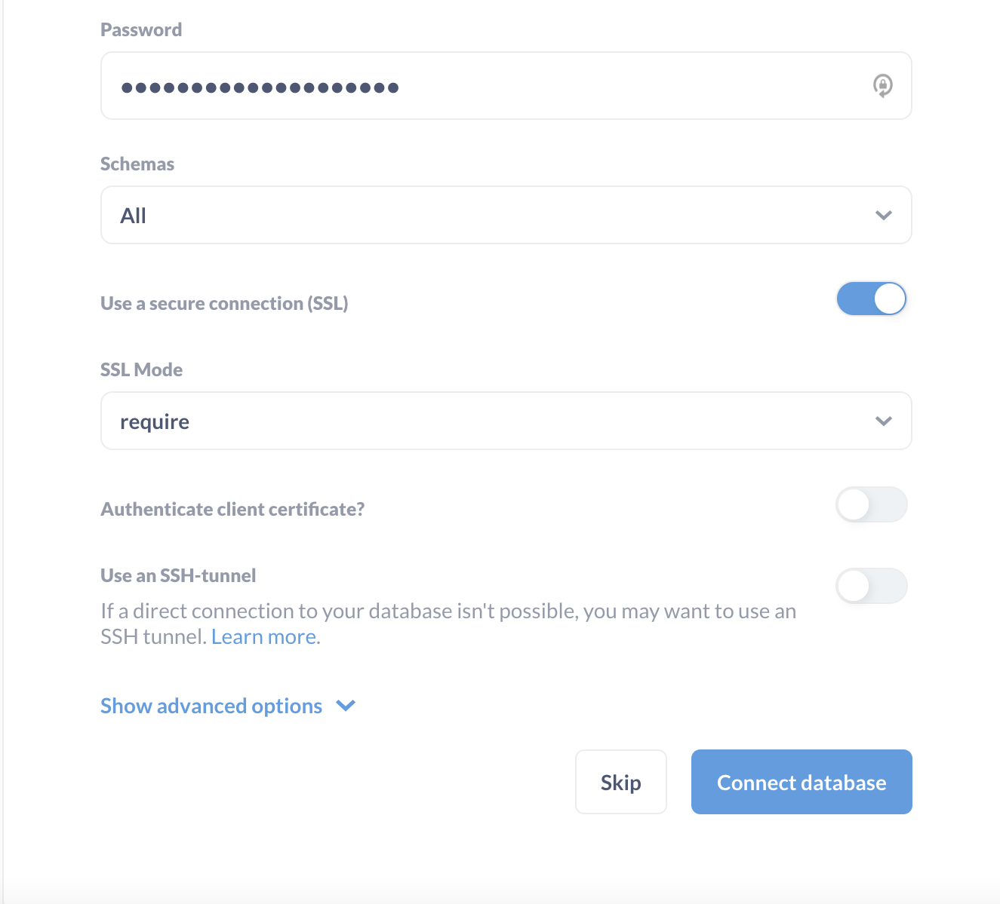

## :tiger: Why is Metabase so cool?

Similarly to dbt, [Metabase](https://www.metabase.com) is an open source software provided as a paid cloud version or free self-hosted.

Metabase is awesome in multiple ways. It can be defined as a BI tools, with two main parts:

- A query tool, with wysiwyg editor and SQL query support.
- A dashboard tool, with a well polished and intuitive interface.

Metabase **does not store your data**, but they will store your queries syntax and metadata required to build your dashboards. I guess that the name *meta(data)base* comes from this point :wink:.
By default, for the self-hosted version, they store this data inside a SQLite database but you can opt for your own SQL database as a backend (much better for production). 

## Install Metabase

For this tutorial, **we will use the self-hosted free version**.

Metabase can be installed from multiples ways, as explained in their official documentation: java JAR file, Docker image, or from source.  

### Option 1: install Metabase with desktop JAR version

Metabase is proposed a a Java file (JAR). If you computer has a Java Runtime >=8 (JRE), such as MacOS or most of Linux/Unix distributions, it's the easiest way to try it.

Express guide : 

1. download Metabase from <https://www.metabase.com/docs/latest/installation-and-operation/installing-metabase>
2. push it in a folder called for example "metabase". because it will generate files.
3. Open a terminal, go to this folder and type `java -jar metabase.jar`.

### Option 2: Install Metabase via Docker in the cloud

If you are more into Docker or source installation, follow their official tutorials on 
<https://www.metabase.com/docs/latest/>.

This is the option selected for this workshop on my side, by doing this:

1. I'm not admin on my professional laptop, so I launched an OVHcloud virtual marchine (instance).
2. Go in `OVHcloud Control panel / Public Cloud / Instance / new`.
3. create a new instance, from Discovery range (the cheapest) with latest Ubuntu (22.10 at the time) and public network (you need a SSH key to complete the installation).
4. Once created, follow official Metabase instructions from their website documentation

If you followed official instrcutions, shortly after installation you can connect to your metabase instance via <http://<your_VM_ip>:3000> and be redirected to the welcome screen.

## Connect your datawarehouse to Metabase

Metabase comes with a large choice of official data sources connectors, but also partners and community-based ones.
MySQL, PostgreSQL, MongoDB, BigQuery, Snowflake, Apache Spark, Google Analytics, ... but also Hydra, DuckDB and more.

> :bulb: List of official connectors: <https://www.metabase.com/data_sources/>.

Once installed, click on `Get started`, fill the informations and add a PostgreSQL source.

For an OVHcloud for PostgreSQL database, fill is at below (be careful, SSL is in `require` mode):

If your connector is correctly configured, you should be able to browse you data through the left menu.

Metabase provides a sample database, and one that we called `Workshop`.

If you browse this data, you will eventually see all the tables generated via dbt.
The ones with raw data, and the ones generated (`customers` and `countries`).

Metabase built a handy feature called X-ray (the lightning strike), generating automatically some reports about a specific table.
Try it with your customers table for example :

## Build awesome dashboards

When you query you data, Metabase allows you to save your query and his visualisation. 
A Dashboard is composed to saved visualisation and filtering options. 
You can see a dashboard as virtual collection of previously-made visualizations. 

So, you start by querying the data, then save the results and finally add them into dashboards.

## Query your data

On the top right menu, click on the `+ NEW` button and select `Question`.

Pick the `/Workshop/customers/` data table. It will open a visual interface allowing you to filter, sort, limit your queries, as classic SQL queries. You also have advanced features like SQL join, ...

This interface is pretty straightforward, play a bit with the tool.
As an example, do a `Count of rows` by `country`, then click on the small `Preview`button on the right.

> :bulb: on the `+ NEW` button, you can also create a new **SQL query via code editor**. You can also create **Metabase models**, like in dbt. you have the ability to synchronize your dbt models and documentation with Metabase via extra python package such as [dbt-metabase](https://github.com/gouline/dbt-metabase).

## Add a visualization to the dashboard

Once your query fits your need, click on `Visualize`. on the left menu, you can modify visualization type and few settings.

Example:

**Save** your question when you're satisfied ! Metabase will automatically suggest to add this question to a dashboard.

## Exercise 3: build your first dashboard

Our sales team discovered your BI platform project. They would love a first dashboard with 4 informations. we don't judge their relevancy here :wink: :

- Total of customers we have.
- Table with top 5 customers information, sorted by amount of orders (not revenue).
- Distribution of amount of orders per customer as a bar chart.
- Mixed chart with revenue in vertical Bars and amount of orders as Line per country.

All of that with a dashboard filter, per country.

At the end it should look a bit like this (again, dummy representations):

> :bulb: If you have some issues with this exercise, you'll find queries details in this repository, as always!

## :thumbsup: Dashboards made easy!

As you can feel it, Metabase *is* cool. tons of features yet quite simple to install and run. With an open source mindset.

This workshop is over, time for a [quick conclusion](part7conclusion.md)!